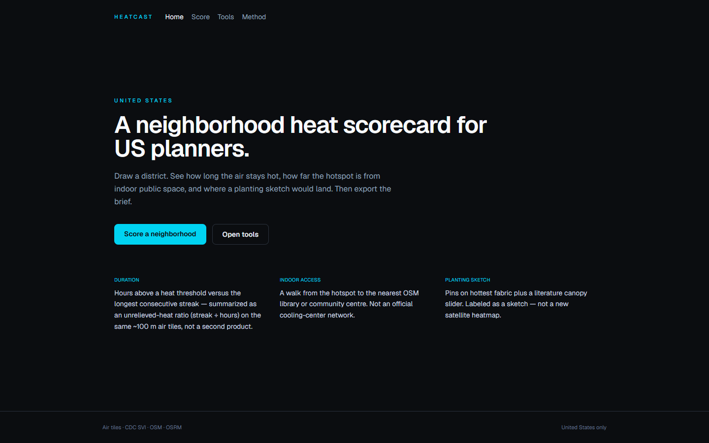
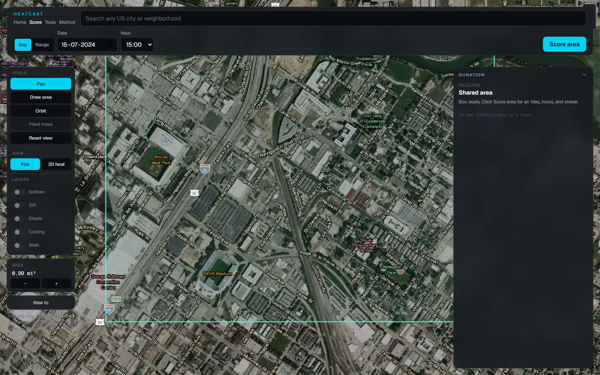
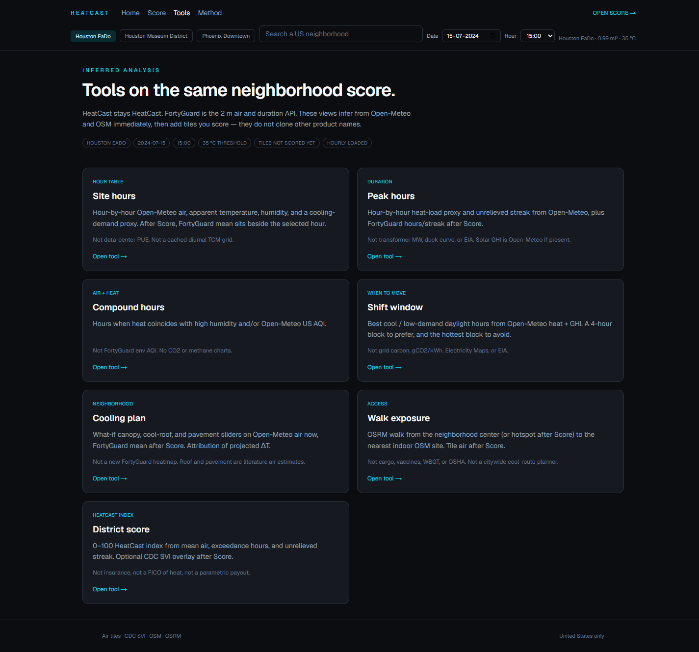
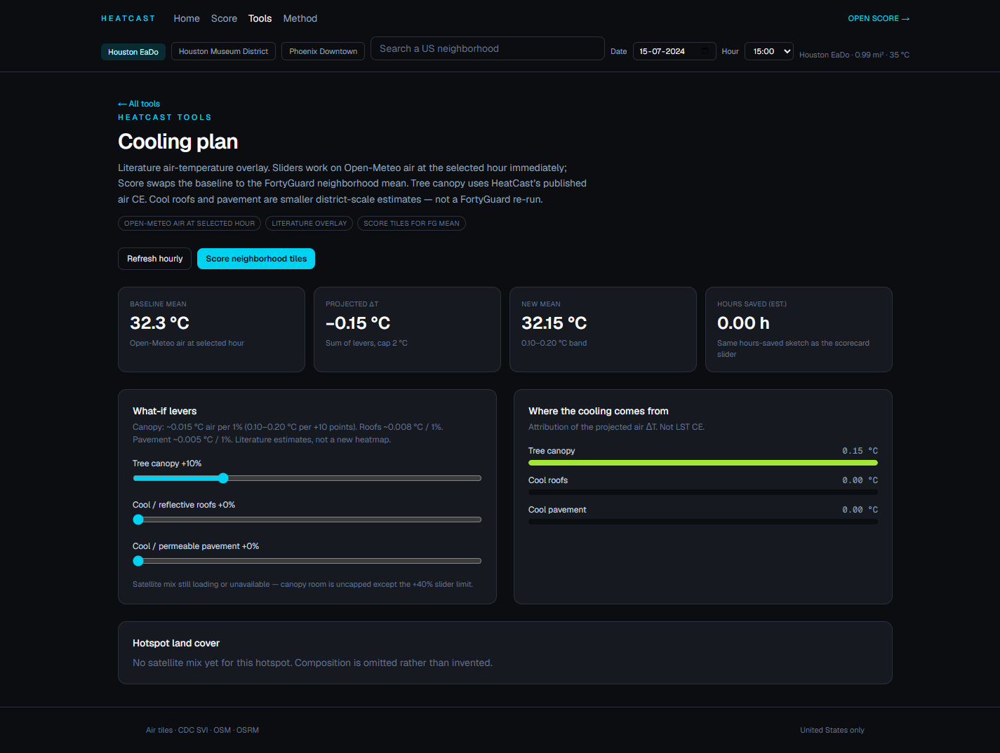
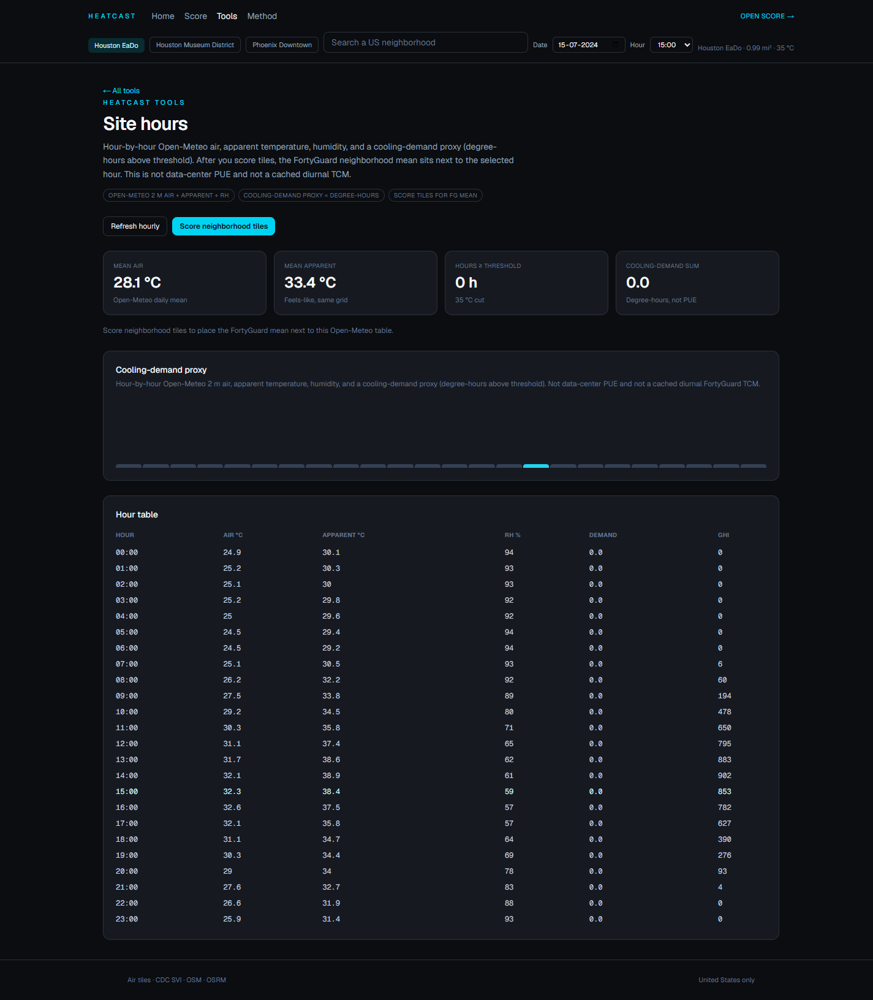
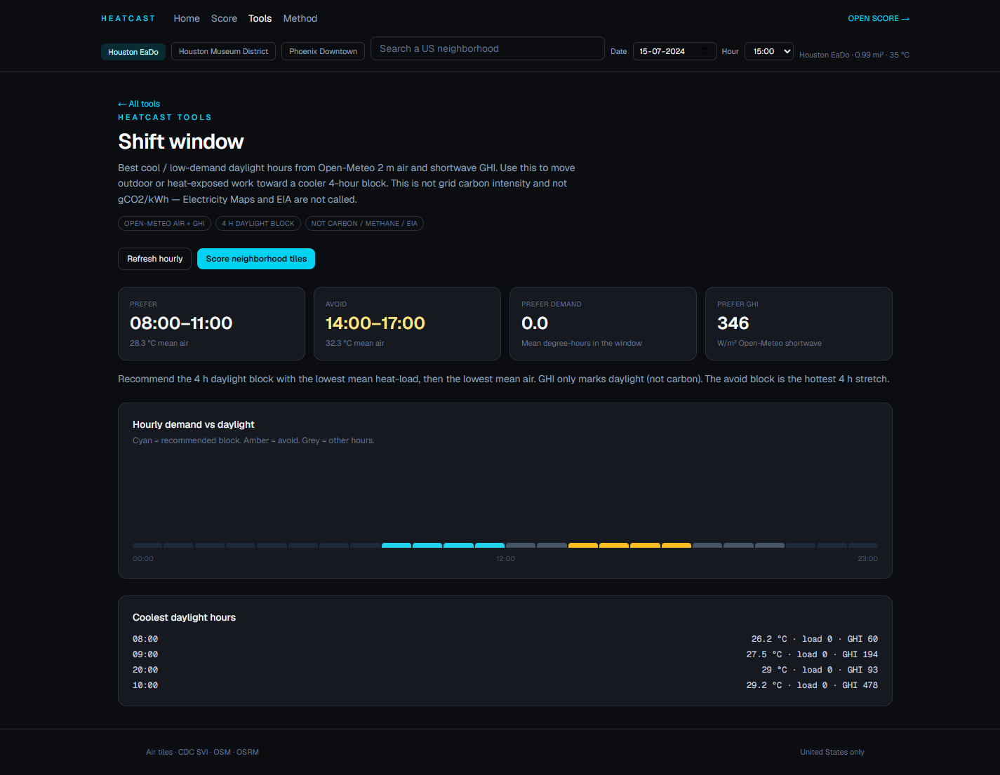

# HeatCast

HeatCast is a neighborhood heat scorecard for United States planners. Draw an area of interest, choose a historic summer **Day** or a **Range** (at most seven days) and an hour, then score ~100 m **Thermal Comfort Map** tiles — FortyGuard two-metre air, hours above a local threshold, and the longest consecutive streak. The map then layers CDC/ATSDR **Social Vulnerability Index** tracts, OpenStreetMap indoor public sites, an Open Source Routing Machine walk from the hotspot, and a literature planting overlay. A separate **Tools** workspace infers site hours, peak load, compound heat, shift windows, cooling levers, walk exposure, and a 0–100 HeatCast district index from the same box — without treating FortyGuard as the name on every chip.

[Live demo](https://web-pearl-ten-99.vercel.app) · [Score](https://web-pearl-ten-99.vercel.app/app) · [Tools](https://web-pearl-ten-99.vercel.app/tools) · [Method](https://web-pearl-ten-99.vercel.app/method) · [API](https://heatcast-api-production.up.railway.app/health) · [Demo video](https://drive.google.com/drive/folders/1GTT19Evm6FhZMA4eqyBQGxRledEz03Je?usp=drive_link) · [GitHub](https://github.com/Galabavamsi/heatcast)

Site navigation is **Home · Score · Tools · Method**.

---

## Screenshots

Landing: product pitch and entry points into Score and Tools.



Score: Houston East Downtown on Esri World Imagery with place labels, transportation overlay, and a drawn area of interest. **Score area** is left unclicked here so a README visit does not bill FortyGuard credits.



A scored run on the same district: translucent two-metre air raster (`heatcast-raster`), hotspot label, indoor OpenStreetMap pins, and the scorecard overlay (mean/max air, hours above 35 °C, Social Vulnerability Index join, canopy slider).


Tools hub: seven inferences on the same United States box and demo date. Cards load Open-Meteo immediately; they do not auto-score tiles.



Cooling plan: literature sliders on Open-Meteo air at the selected hour (FortyGuard mean after Score).



Site hours: hour-by-hour Open-Meteo air, apparent temperature, relative humidity, and a cooling-demand proxy.



Shift window: coolest four-hour daylight block from Open-Meteo heat load and Global Horizontal Irradiance — not grid carbon.



---

## Features

### Score (`/app`)

- Search any United States city or neighborhood (Nominatim, `countrycodes=us`), or draw a box between **0.04 mi²** and **45 mi²**.
- **Day** scores one date. **Range** adds **To** (at most seven inclusive days). Two-metre air, shade, and comfort always use **From + Hour**.
- **Score area** requests FortyGuard Thermal Comfort Map tiles plus exceedance (hours above threshold) and persistence (longest streak).
- On a Range score, a second Thermal Comfort Map at **To + the same Hour** produces **ΔT (range)** (To − From) and noisy **ΔT edges** (|∇ΔT|). **Play** cycles Hour as a preview only; it does not recompute ΔT or call Score.
- Map layers: isolines burned into the heat canvas; Social Vulnerability Index tracts; SunCalc shade on OpenStreetMap footprints; indoor pins; Open Source Routing Machine walk from the hotspot.
- Scorecard overlay (Duration / Place / Brief): hours-versus-streak charts, unrelieved-heat ratio, heat × vulnerability, cooling-site list, literature canopy slider, planner brief.
- **Export** (after Score) downloads scorecard JSON, area-of-interest and hotspot GeoJSON, the planner brief, and tile payloads when present. A share URL restores the box, date, optional end date, and hour — it does not auto-score.

### Tools (`/tools`)

A first-class workspace on the same share parameters (`west`, `south`, `east`, `north`, `date`, `time`). Every tool auto-loads the free Open-Meteo hourly series after the URL hydrates. None of them auto-score FortyGuard tiles.

---

## How it works

```
┌─────────────┐     ┌──────────────────┐     ┌─────────────────────┐
│ Next.js web │────▶│ FastAPI          │────▶│ FortyGuard Premium  │
│ MapLibre 6  │     │ analyze · enrich │     │ TCM · exceedance    │
│ :3000       │     │ tools · brief    │     │ persistence         │
└─────────────┘     └──────────────────┘     └─────────────────────┘
        │                     │
        │                     ├─ Open-Meteo (air, RH, GHI, US AQI)
        │                     ├─ OpenStreetMap Overpass
        │                     ├─ Open Source Routing Machine
        │                     ├─ CDC/ATSDR SVI 2022
        │                     └─ optional LLM brief (server-side)
        └─ Esri World Imagery + World_Transportation
           + World_Boundaries_and_Places
```

The FortyGuard API key never leaves `api/.env`. The Next.js app talks only to `NEXT_PUBLIC_API_URL`. Heat fill is a canvas raster draped as a MapLibre **image** source named `heatcast-raster` — not a GeoJSON polygon redraw on every frame.

| Layer | Source | Role |
|---|---|---|
| Two-metre air | FortyGuard Thermal Comfort Map, ~100 m | Mean, max, share of tiles above threshold |
| Hours / streak | FortyGuard exceedance + persistence | Duration on the same grid |
| Social Vulnerability Index | CDC/ATSDR 2022 census tracts | Equity join; SVG overlay |
| Indoor pins | OpenStreetMap `library`, `townhall`, `community_centre`, `social_facility` | Access check in the box |
| Walk | Open Source Routing Machine walking | Hotspot (or box center) → nearest indoor site |
| Shade | OpenStreetMap footprints + SunCalc | Approximate umbra, not measured canopy |
| Comfort chip | Open-Meteo | Afternoon heat index / relative humidity at km scale |
| Basemap | Esri World Imagery + transportation + places | Satellite context under a translucent heat tint |

---

## Tools catalog

| Tool | Route | Infers | Does not claim |
|---|---|---|---|
| **Site hours** | `/tools/hours` | Open-Meteo hourly two-metre air, apparent temperature, relative humidity, Global Horizontal Irradiance, and a cooling-demand proxy (degree-hours above threshold). After Score, the FortyGuard neighborhood mean sits beside the selected hour. | Data-center power usage effectiveness. A cached diurnal FortyGuard Thermal Comfort Map. |
| **Peak hours** | `/tools/peak` | Open-Meteo hourly two-metre air → degree-hours above threshold and an unrelieved streak. Optional Global Horizontal Irradiance panel. After Score: FortyGuard mean hours, streak, and unrelieved-heat ratio. | Transformer megawatts, duck curve, or Energy Information Administration series. |
| **Compound hours** | `/tools/compound` | Hours when heat coincides with high relative humidity and/or Open-Meteo United States Air Quality Index (when the free series lands). | FortyGuard `env_params` Air Quality Index on this path. Carbon dioxide or methane. |
| **Shift window** | `/tools/shift` | Coolest four-hour daylight block from Open-Meteo heat-load + Global Horizontal Irradiance, plus the hottest block to avoid. | Grid carbon intensity, gCO₂/kWh, Electricity Maps, or Energy Information Administration. |
| **Cooling plan** | `/tools/cooling` | Literature air-temperature overlay. Sliders run on Open-Meteo air immediately; Score swaps the baseline to the FortyGuard mean. Canopy uses ~0.015 °C air per 1% canopy. Optional cool-roof (~0.008 °C per 1%) and pavement (~0.005 °C per 1%) levers, attribution bars, satellite mix at the hotspot if enrich already returned buckets. | A new FortyGuard heatmap. Land-surface-temperature cooling efficiency. Invented building-share percents. |
| **Walk exposure** | `/tools/walk` | OpenStreetMap indoor sites + Open Source Routing Machine from the box center immediately. After Score: hotspot origin and nearest Thermal Comfort Map samples along the line. Walk destinations are `library`, `townhall`, `community_centre`, and `social_facility` only. | Cargo, vaccines, wet-bulb globe temperature, Occupational Safety and Health Administration limits, multi-stop logistics, or an official cooling-center registry. |
| **District score** | `/tools/district` | 0–100 HeatCast index from mean air versus threshold, exceedance hours, and unrelieved streak. Open-Meteo preview first; FortyGuard after Score; optional Social Vulnerability Index overlay. | Insurance, a FICO of heat, or a parametric payout. |

Default preset is Houston East Downtown (threshold **35 °C**). Phoenix downtown uses **38 °C**. Demo datetime is **2024-07-15 15:00**.

---

## Scoring rules

Coverage is the **United States only**. The drawn polygon must be **0.04–45 mi²**. Area uses WGS84 metres-per-degree of latitude, with longitude scaled by **cos(latitude)** — not Web Mercator.

Granularity is **~100 m** Thermal Comfort Map tiles (two-metre air), not sidewalk computational fluid dynamics.

**Threshold.** Houston and most of the contiguous United States use **35 °C**. A Phoenix-like box (`latitude > 32.5` and `longitude < −110`) uses **38 °C**.

**Duration.** Same From and To → exceedance/persistence `filter_type=3` (one day, no `end_date`). A 2–7 day span → `end_date` + `filter_type=4` (range-of-days product, not a custom N-day exceedance). Air tiles, shade, and comfort still use From + Hour (`filter_type=1`).

**Unrelieved-heat ratio.**

```
unrelieved_heat_ratio = clip(mean_streak_hours / mean_hours_above, 0, 1)
```

Near 1 means those hours arrived as one unbroken run. This is a HeatCast duration index, not a wet-bulb globe temperature table or an Occupational Safety and Health Administration work/rest schedule. Method copy cites [NIOSH Heat Stress: Work/Rest Schedules (2017-127)](https://www.cdc.gov/niosh/docs/2017-127/pdfs/2017-127.pdf) as context only.

**Literature canopy.** The slider estimates a small air-temperature change from added canopy: central **0.015 °C per 1%** canopy (about 0.10–0.20 °C per +10 percentage points), capped at 2 °C. It is an overlay on existing tiles, not a new FortyGuard heatmap. HeatCast does not apply land-surface-temperature cooling efficiency (~0.075 °C per 1%).

**Range ΔT.** Two Thermal Comfort Map snapshots at one clock hour. ΔT edges are noisy 100 m gradients, not a heat flux.

Presets (all **2024-07-15 15:00**): Houston East Downtown, Houston Museum District, Phoenix Downtown.

---

## Quick start

Requires **Python 3.11+**, **Node 20+**, and a FortyGuard API key.

### 1. API

**Windows (PowerShell)**

```powershell
git clone https://github.com/Galabavamsi/heatcast.git
cd heatcast
python -m venv .venv
.\.venv\Scripts\activate
pip install -r api\requirements.txt
copy api\.env.example api\.env
# set FORTYGUARD_API_KEY in api/.env
cd api
uvicorn app.main:app --host 0.0.0.0 --port 8000 --reload
```

**macOS / Linux**

```bash
git clone https://github.com/Galabavamsi/heatcast.git
cd heatcast
python -m venv .venv
source .venv/bin/activate
pip install -r api/requirements.txt
cp api/.env.example api/.env
# set FORTYGUARD_API_KEY in api/.env
cd api
uvicorn app.main:app --host 0.0.0.0 --port 8000 --reload
```

### 2. Web

```powershell
cd web
npm install
npm run dev
```

Open [http://localhost:3000](http://localhost:3000) (Home), [http://localhost:3000/app](http://localhost:3000/app) (Score), [http://localhost:3000/tools](http://localhost:3000/tools), and [http://localhost:3000/method](http://localhost:3000/method).

### Tests

```powershell
cd api
python -m unittest discover -s tests -v
```

---

## Environment

All FortyGuard and language-model secrets stay in **`api/.env`** (gitignored). Never put a FortyGuard key in `NEXT_PUBLIC_*` or in the Vercel web project.

| Variable | Where | Required | Notes |
|---|---|---|---|
| `FORTYGUARD_API_KEY` | `api/.env` | yes | Server only |
| `FORTYGUARD_BASE_URL` | `api/.env` | no | Default `https://api.fortyguard.com` |
| `PORT` | `api/.env` / host | no | Bind `0.0.0.0:$PORT` (Railway injects `PORT`) |
| `LLM_API_KEY` | `api/.env` | no | Planner brief. Without it, Score uses a template memo |
| `LLM_BASE_URL` | `api/.env` | no | DeepSeek: `https://api.deepseek.com/v1` |
| `LLM_MODEL` | `api/.env` | no | Default `deepseek-v4-flash` |
| `CORS_ORIGINS` | `api/.env` | no | Extra origins. localhost and `https://*.vercel.app` are always allowed |
| `NEXT_PUBLIC_API_URL` | `web/.env.local` | no | Default `http://localhost:8000`. Production must be the public API URL **before** the web build |
| `NEXT_PUBLIC_CARTO_API_KEY` | `web/.env.local` | no | Optional Carto dark basemap. Without it, HeatCast uses keyless Esri World Imagery |

Do not commit `.env`, keys, or `api/cache/`.

---

## API surface

Production: [https://heatcast-api-production.up.railway.app](https://heatcast-api-production.up.railway.app) · health: [`GET /health`](https://heatcast-api-production.up.railway.app/health)

| Method | Path | Purpose |
|---|---|---|
| `GET` | `/health` | Liveness (`{"ok": true, "service": "heatcast"}`) |
| `GET` | `/v1/cities` | Demo presets and scenario-model metadata |
| `GET` | `/v1/geocode` | Nominatim, United States only |
| `POST` | `/v1/analyze` | Thermal Comfort Map + exceedance + persistence + optional Range ΔT + scorecard + template brief. Does not wait on enrich or the language model |
| `POST` | `/v1/enrich` | Satellite mix and environmental parameters, then optional street view. Fail-open |
| `POST` | `/v1/brief` | Rewrite the planner brief after satellite / Social Vulnerability Index / OpenStreetMap land |
| `POST` | `/v1/svi` | CDC/ATSDR Social Vulnerability Index 2022 tracts joined to the heatmap |
| `GET` | `/v1/walk` | Open Source Routing Machine walking, United States only, fail-open |
| `GET` | `/v1/cooling` | OpenStreetMap indoor public sites |
| `GET` | `/v1/buildings` | OpenStreetMap footprints |
| `GET` | `/v1/weather` | Open-Meteo rain / heat index / hourly + Global Horizontal Irradiance + optional United States Air Quality Index |
| `GET` | `/v1/tools/hours` | Open-Meteo peak, compound, site-hours, shift window, and district preview (no FortyGuard call) |
| `POST` | `/v1/tools/cooling` | Literature cooling-plan attribution (no FortyGuard call) |
| `POST` | `/v1/tools/walk-exposure` | Nearest Thermal Comfort Map sample along an Open Source Routing Machine polyline |
| `POST` | `/v1/tools/district-index` | 0–100 HeatCast index from scorecard fields |
| `POST` | `/v1/scenario` | Literature ΔT without re-running FortyGuard |

FortyGuard products used server-side: `tcm`, `exceedance`, `persistence`, `environmental_parameters`, `satellite_segmentation`. Failed FortyGuard tasks are not billed; an empty successful heatmap still is. Cache key is area of interest + datetime + analytic type.

---

## Deploy

| Surface | Host | Live URL |
|---|---|---|
| Web | Vercel (project Root Directory `web`; repo `vercel.json` also copies `web/.next` if the root is the monorepo) | https://web-pearl-ten-99.vercel.app |
| Score | same | https://web-pearl-ten-99.vercel.app/app |
| Tools | same | https://web-pearl-ten-99.vercel.app/tools |
| Method | same | https://web-pearl-ten-99.vercel.app/method |
| API | Railway (`api/`, `railpack.json`) | https://heatcast-api-production.up.railway.app |
| API health | Railway | https://heatcast-api-production.up.railway.app/health |

Set `NEXT_PUBLIC_API_URL` on the Vercel project to the public Railway API origin **before** building the web app. Set `FORTYGUARD_API_KEY` (and optional `LLM_*`) only on the API service. CORS already allows `https://*.vercel.app`.

A `render.yaml` Blueprint remains in the repo if you prefer two Render web services instead of Vercel + Railway. Bind HTTP to `0.0.0.0:$PORT` on either host. The filesystem is ephemeral — demo caches are not frozen across deploys.

---

## Demo video

Walkthrough clips live in this Drive folder:

https://drive.google.com/drive/folders/1GTT19Evm6FhZMA4eqyBQGxRledEz03Je?usp=drive_link

Suggested live path for a recording: Home → Score (Houston East Downtown, **2024-07-15 15:00**, box under 45 mi²) → Tools (Open-Meteo views) → Method.

---

## Limits

- **Historic dates.** Prefer a covered summer afternoon such as `2024-07-15 15:00`. A “today” or future date can complete with **zero tiles** and still be billed — that is a coverage miss, not 0 °C.
- **United States only.** No international Thermal Comfort Map path.
- **Neighborhood UHI, not sidewalk CFD.** Tiles are ~100 m.
- HeatCast does **not** compute wet-bulb globe temperature, Universal Thermal Climate Index, National Weather Service HeatRisk, Occupational Safety and Health Administration exposure limits, insurance scores, or grid carbon / gCO₂/kWh.
- OpenStreetMap libraries and community centres are **not** an official cooling-center list. Shade is geometry plus sun position, not a FortyGuard shade product. Walk is a single hotspot-to-indoor check, not a citywide cool-route planner.
- The canopy / roof / pavement sliders are **literature air estimates** on existing measurements. They do not re-simulate FortyGuard.
- Range ΔT is two snapshots at one clock hour. Play does not animate a ΔT movie.
- Afternoon comfort from Open-Meteo is kilometer-scale context, labeled separately from FortyGuard tiles.

Honest layer notes also live on the in-app [Method](https://web-pearl-ten-99.vercel.app/method) page.

---

## License and credit

Source: [github.com/Galabavamsi/heatcast](https://github.com/Galabavamsi/heatcast).

Built for FortyGuard Hackathon ’26 · Team HumanSlop · FG-141 · Track 1.

FortyGuard, OpenStreetMap, Open-Meteo, Esri, CDC/ATSDR, and Open Source Routing Machine remain the rights of their respective owners. HeatCast scores a district and layers public context; it does not replace those products.
