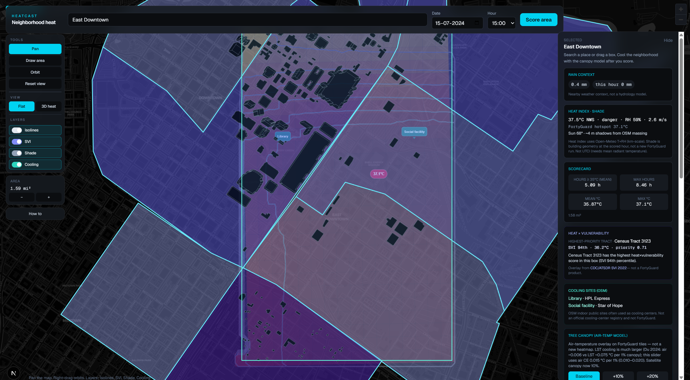
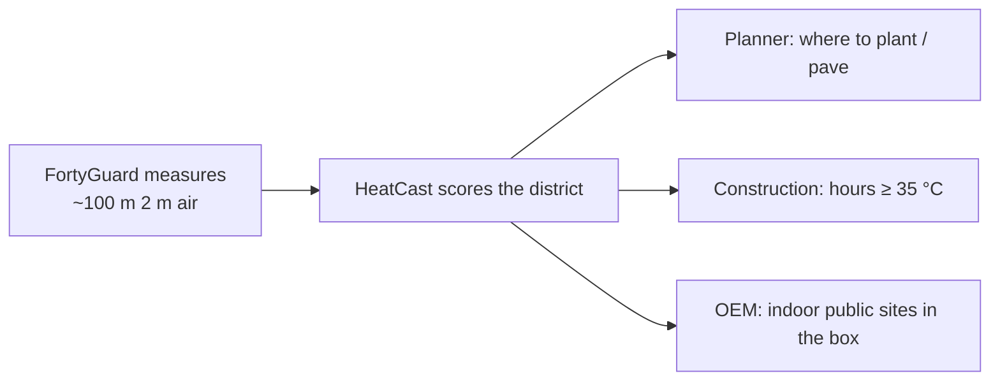
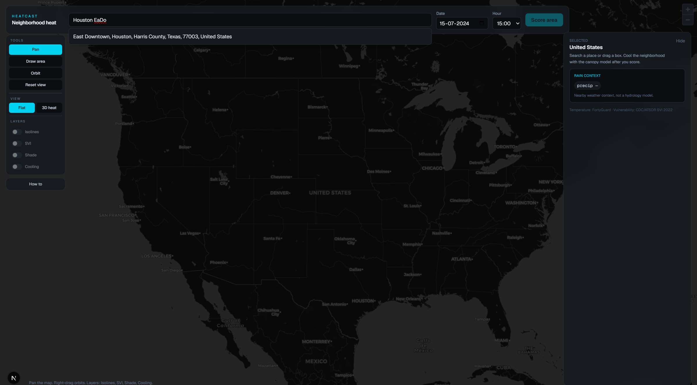
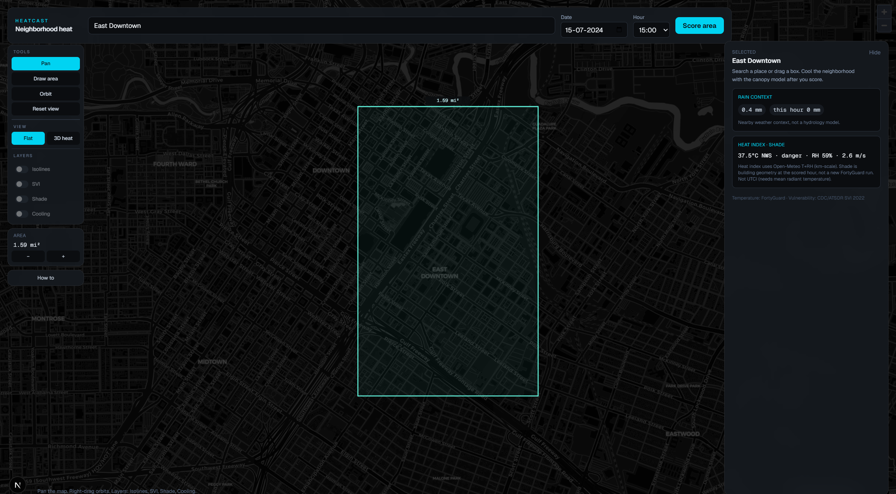
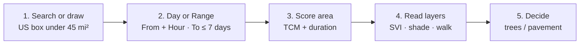
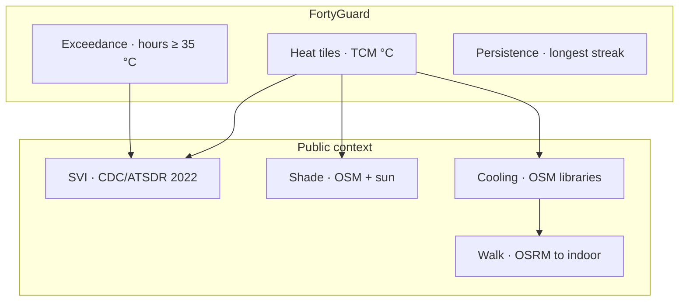
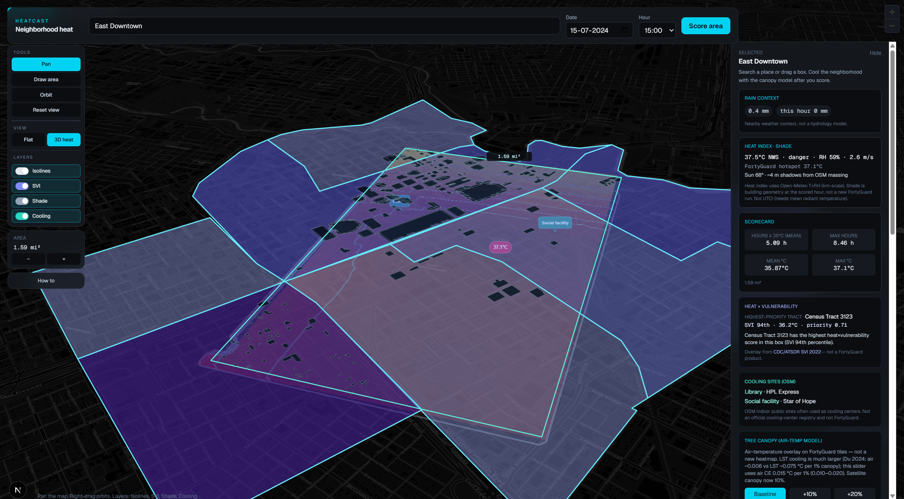
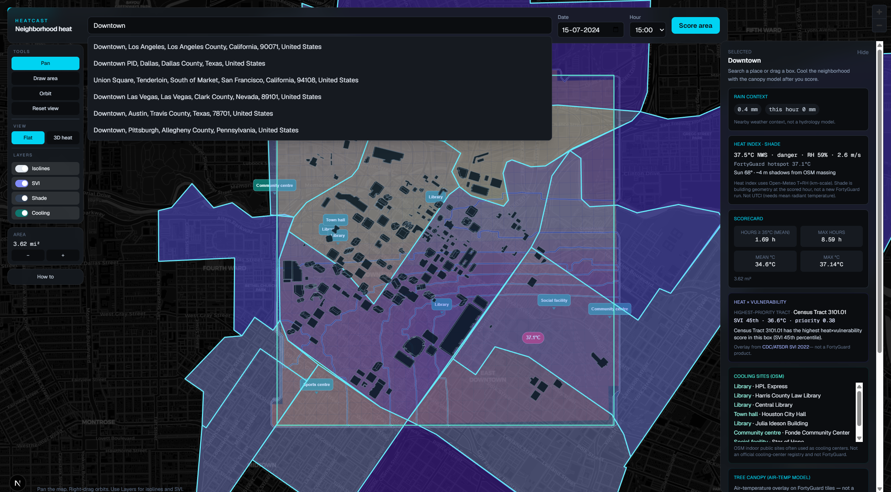
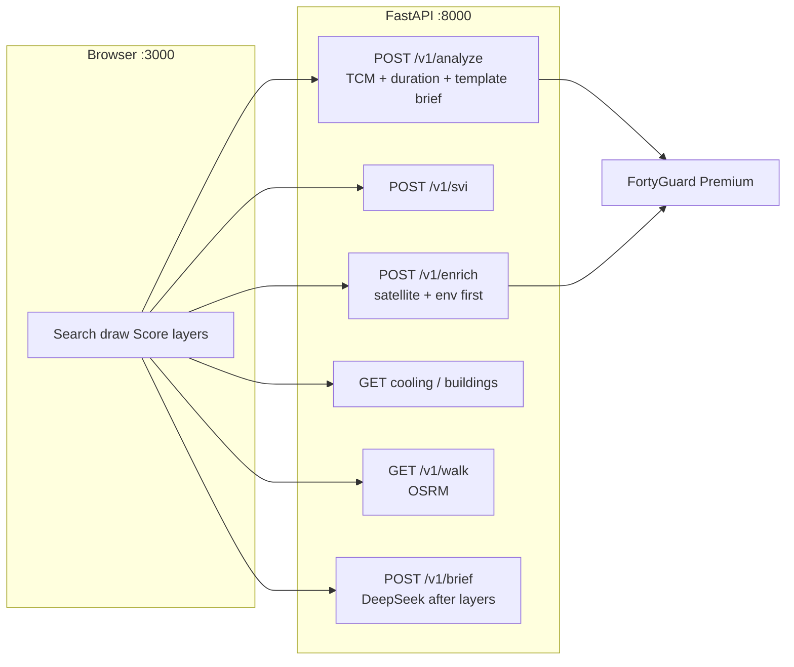

# HeatCast

Neighborhood heat scorecard for **FortyGuard Hackathon’26**.

Draw a US neighborhood, pick **Day** or a **Range** (max 7 days) and an hour, **Score area**. You get FortyGuard ~100 m **2 m air** tiles (temperature + hours above threshold + longest streak), an **unrelieved-heat ratio**, CDC social-vulnerability tracts, OSM shade and indoor public sites, an OSRM walk from the hotspot to a library or community centre, and a planner brief that names what to do next.



| | |
|---|---|
| **Team** | HumanSlop · **FG-141** |
| **Track** | 1 — urban planning |
| **Deadline** | 30 Aug 2026 |
| **Repo** | [github.com/Galabavamsi/heatcast](https://github.com/Galabavamsi/heatcast) |
| **Local folder** | `D:\fortyguard\heatlens` (UI name HeatCast; folder is still heatlens) |

**Living team notes** (status, changelog, open work): [HANDOVER.md](./HANDOVER.md).

---

## What we are building, and who it is for

HeatCast answers one planner question:

> On this block, on this summer afternoon (or over a few days), **how hot is the air, how long does it stay hot, who is most exposed, how far is indoor public space, and what can we actually do** (trees, cool pavement)?

It is **not** sidewalk CFD, not a citywide cool-commute planner, and not a FortyGuard “add trees and re-simulate” product. FortyGuard measures. HeatCast **scores a district** and layers public context on top. Walk is a thin hotspot → indoor check, not a second product.



| Person | Job they have | What HeatCast gives them |
|---|---|---|
| **City planner / sustainability staff** | Where to plant or re-pave first | Hottest tiles × high-SVI tracts + satellite mix (canopy vs pavement) |
| **Construction / outdoor-work PM** | Can this pad take a July afternoon? | Mean/max **hours ≥ 35 °C** (Houston) and longest streak on the real FortyGuard duration layers |
| **OEM / public health** | Where are people during a heat event? | OSM libraries and community centres **in the same box**, plus a walk from the hotspot (not an official cooling-center list) |
| **Hackathon judges** | Is FortyGuard central? | Live TCM + exceedance `activity_id`s on the coverage strip |

---

## Worked example: Houston East Downtown, 15 Jul 2024, 15:00

This is a real Score from the running app (same settings you should demo). The PNG is older chrome; the numbers below are from that Score.





Area on the map is a **WGS84** rectangle: metres-per-degree of latitude, longitude scaled by **cos(lat)**. Not Web Mercator. The Houston share-URL box (`west=-95.40236&south=29.73387&east=-95.37434&north=29.75282`) is **≈ 2.20 mi²**. A smaller hand-drawn EaDo box from this Score was **1.59 mi²** (417 tiles). Stay under the **45 mi²** cap.

| Signal | Number | What you do with it |
|---|---|---|
| FortyGuard mean / max | **35.87 / 37.1 °C** | Peak hour is already above Houston’s 35 °C threshold |
| Share of tiles ≥ 35 °C | **~78%** | Most of the box is in exceedance at 15:00, not one freak tile |
| Hours ≥ 35 °C | **mean 5.09 h · max 8.46 h** | Duration story for outdoor work — not just the 37.1 °C pin |
| Unrelieved-heat ratio | streak ÷ hours (0–1) | Near 1 means those hours arrived as one unbroken run. HeatCast index, not a WBGT table. |
| Hotspot | **29.7513, −95.3520 · 37.1 °C** | Where to look first on the map; walk starts here |
| NWS heat index (Open-Meteo) | **37.5 °C · danger · RH 59%** | Comfort context at km scale; labeled separately from FG |
| Satellite at hotspot | **~10% plant/canopy · ~56% impervious** (roads ~52%) | Cause tag: thin canopy + pavement → EPA cool pavement + USDA i-Tree |
| SVI | **Census Tract 3123 · 94th percentile · 36.2 °C** | Highest heat×vulnerability in the box — equity priority |
| Cooling sites (OSM) | **HPL Express (library), Star of Hope** | Indoor public space already in the neighborhood |
| Walk | Hotspot → nearest library / community centre | OSRM walking line in the Area card; not a citywide cool route |
| Tree slider | **+10% ≈ −0.15 °C · +20% ≈ −0.30 °C** | Literature overlay **on the existing tiles**, not a new FG heatmap |
| Shade at 15:00 | **Sun ~68° · ~4 m shadows** | July afternoon sun is high; building shade is short. Don’t oversell umbra. |

Planner brief (same run, after satellite + SVI landed):

> East Downtown shows a FortyGuard TCM mean of 35.87°C with 77.9% of tiles above the 35°C threshold, averaging 5.09 hours of exceedance. FortyGuard satellite data indicates only 10.1% canopy cover against 56.01% impervious surfaces… This low-canopy, high-impervious combination supports **EPA Heat Island cool pavement** and **USDA Forest Service i-Tree** planting. CDC/ATSDR SVI 2022 identifies **Census Tract 3123** as the highest-vulnerability area at the 94th percentile…

**Decision that example supports:** do not treat “plant anywhere in EaDo” as the plan. Put trees and cool pavement on the **hottest, most paved tiles**, and treat Tract 3123 as the equity check even if it is not the single hottest third.

Museum District, **same date**, is the greener control tract (preset `houston-museum`). Phoenix downtown uses threshold **38 °C** and **must** use `2024-07-15`, not `2026-08-17`.

---

HeatCast is a small site plus the map:

| Route | What it is |
|---|---|
| `/` | Product landing (duration / indoor walk / planting beats + **Score a neighborhood**) |
| `/app` | Map + scorecard (the product) |
| `/method` | Honest layer notes (what it is / is not) |

Nav: **HeatCast · Score · Method**. After Score, **Export** (header, next to **Scorecard**) downloads scorecard JSON, AOI+hotspot GeoJSON, the planner brief `.txt`, and (if present) hours/TCM tiles. A share URL restores the box, date, optional end date, and hour — it does **not** auto-score.

## How a session works



1. Open **`/app`** (or **Score a neighborhood** from `/`). **Search** a US city or neighborhood, or click **Draw area** and drag a box (Space pans, scroll still zooms). Stay under **45 mi²**.
2. Leave **From = 2024-07-15** and **Hour = 15:00** for the demo (historic summer; Phoenix 2026-08-17 can return 0 tiles and still bill). **Day** scores one date. **Range** adds **To** (max 7 inclusive days). TCM, shade, and comfort always use **From + Hour**.
3. Click **Score area**. Heatmap appears first. SVI, OSM, walk, and satellite follow. The brief starts as a template, then rewrites. Export when you want a file.
4. Toggle **Isolines / SVI / Shade / Cooling / Walk**. Switch **Flat → 3D heat** and right-drag to orbit.
5. Use **+10% / +20% canopy** only as a labeled estimate. FortyGuard does **not** recompute.

Duration mapping (honest FortyGuard `filter_type`):

| UI | Duration request | TCM / shade / comfort |
|---|---|---|
| **Day** (From = To) | `filter_type=3`, no `end_date` (existing one-day caches still hit) | From + Hour (`filter_type=1`) |
| **Range** 2–7 days | `end_date` + `filter_type=4` (range-of-days product, not a custom 3-day exceedance) | Still From + Hour |

**Range ΔT:** when From ≠ To, Score also fetches a second TCM at **To + the same Hour** and maps **ΔT (range)** (To − From) plus noisy **ΔT edges** (|∇ΔT|). Positive tiles got hotter. **Play** only cycles Hour as a preview; it does **not** recompute ΔT or run Score.

---

## Every control, what it is, why it is useful



### Header

| Control | What it does | Example |
|---|---|---|
| **Search** | Nominatim, US only | Type `Houston EaDo` → pick East Downtown |
| **Day / Range** | One date vs From–To (max 7 days) | Range: From `2024-07-15` To `2024-07-18` |
| **Date / From / To / Hour** | Historic snapshot + duration window | Demo: `2024-07-15` `15:00` |
| **Play** | Cycles Hour only (Range). Does not Score, does not recompute ΔT | Preview afternoon vs evening before you spend credits |
| **Score area** | TCM + exceedance + persistence on the drawn polygon | Enabled only when the box is 0.04–45 mi² |
| **Export** | Client downloads after Score | JSON, GeoJSON, brief `.txt` — no API keys |
| **Scorecard** | Opens the right drawer (large screens) or bottom sheet (narrow) | Sits next to Export when the drawer is hidden |

### Tools

| Control | What it does | Why |
|---|---|---|
| **Pan** | Left-drag pans; right/Ctrl-drag orbits the AOI | Inspect without losing the heat raster |
| **Draw area** | Left-drag a new box | “This construction pad”, not a whole county |
| **Orbit** | Left-drag orbits around the heat centroid | 3D inspect; native map rotate would slide heat off-screen |
| **Reset view** | Frames the AOI | After you have flown around |

### View

| Control | What it does | Example |
|---|---|---|
| **Flat** | 2D scorecard (default) | Judging screenshot, legend readable |
| **3D heat** | Pitch + extruded OSM buildings when loaded | Show the pad in context; still the same 100 m tiles |



On the map chrome after Score: **Air temperature** vs **Hours above threshold** vs **Longest streak**. After a Range Score, also **ΔT (range)** and **ΔT edges**.

### Layers

| Layer | Source | On the map | Useful for | Not useful for |
|---|---|---|---|---|
| **Isolines** | Contours burned into the heat canvas | °C lines (e.g. 33.5–36.0) | Seeing gradients inside the box | Claiming sidewalk precision |
| **SVI** | CDC/ATSDR 2022, SVG overlay | Violet tracts; click a tract | Equity: Tract 3123 at 94th percentile | Calling SVI a FortyGuard product |
| **Shade** | OSM footprints + SunCalc | Footprints + umbra | “Is there any building shade at 15:00?” | FG-measured shade or tree canopies |
| **Cooling** | OSM libraries / community centres | Icon-only markers | “HPL Express is in the box” | Official cooling-center registries |
| **Walk** | OSRM walking, SVG polyline | Hotspot → indoor site + Area-card legend | “How far is indoor space from the hotspot?” | Citywide cool-commute planning |



Toggles stay usable as soon as Score returns. Labels show **Shade…** / **Cooling…** while Overpass loads. Walk legend lives in the left-rail **Area** card (`Hotspot → {site}` + minutes), not as a wide map pill.

### Right panel (scorecard overlay)

One right drawer (~21 rem) overlays the map. Header stays full width (`inset-x-4`); it does **not** shrink when the drawer opens. Tabs after Score: **Duration** (or **Day** + **Range** when From ≠ To) · **Place** · **Brief**. Narrow screens use the same tabs in a bottom sheet.

| Block | What it is | Example from EaDo |
|---|---|---|
| **Duration charts** | Share ≥ threshold bar, hours-vs-streak bars, hours histogram | Already-fetched layers — not a new heatmap |
| **Unrelieved-heat ratio** | Mean streak ÷ mean hours, clipped 0–1 | Gauge + method blurb (NIOSH / OSHA cite) |
| **Scorecard** | Mean/max °C and hours ≥ threshold | 5.09 h mean, 8.46 h max |
| **Range ΔT** | To − From at the scored Hour | Mean ΔT on the Range tab; map toggles for tiles / edges |
| **Heat × vulnerability** | SVI joined to tiles | Tract 3123, priority 0.71 |
| **Cooling sites** | OSM list + walk | Library, Star of Hope |
| **Tree canopy slider** | Air CE ~0.015 °C per 1% canopy, cap 2 °C | +20% → about −0.30 °C on the overlay |
| **Planner brief** | Template immediately; DeepSeek after satellite+SVI | EPA / i-Tree only when percents exist |
| **Coverage** | Tile count, cached vs live, datetime | `live · 417 tiles · 2024-07-15T15:00` |
| **Hottest tile** | Lat/lon, satellite class mix, optional street view | Roads 52%, plant 10% |

---

## Honesty (do not weaken for the video)

- FortyGuard is **central**. Tiles are ~100 m neighborhood UHI, not sidewalk CFD. It is **one API** among several (CDC SVI, OSM, OSRM, Open-Meteo). Coverage is **United States only**.
- Area cap **~45 mi²**. We ship **100 m** granularity. Area mi² uses WGS84 metres-per-degree with **cos(lat)** on longitude.
- The canopy slider is a **literature overlay** (~0.015 °C air per 1% canopy, band 0.10–0.20 °C per +10 points, cap 2 °C). **Not** a new FortyGuard heatmap. Do **not** use LST CE (~0.075 °C per 1%).
- `heat_index_celsius` from FG `env_params` is humidity at a fixed T, not a diurnal curve. Duration = **exceedance hours** + **persistence streak**. Afternoon comfort chip = **Open-Meteo**.
- Phoenix **`2026-08-17` can complete with 0 tiles and still be billed**. Coverage miss, not 0 °C. Demo date: **`2024-07-15 15:00`**.
- Failed FG tasks are free; **empty successful heatmaps still cost**. Cache AOI + datetime + analytic type.
- OSM libraries are **not** an official cooling-center registry. Shade is geometry, not a FortyGuard product. Walk is OSRM to the nearest indoor OSM site, not a cool-route optimizer.
- Range ΔT is two TCM snapshots at one clock hour. ΔT edges are noisy 100 m gradients, not a heat flux. Play does not animate N deltas.

Do **not** expand into India, UTCI, NWS HeatRisk, deck.gl, bus-stop clones, a citywide cool-route app, or a second product.

---

## Architecture

```
heatlens/
  api/                 FastAPI (port 8000) — FortyGuard, cache, scoring, brief
  web/                 Next.js 16 + MapLibre 6 (port 3000)
  docs/images/         README screenshots
  HANDOVER.md          living snapshot for both developers
```



The FortyGuard key never leaves `api/.env`. The Next app talks only to `NEXT_PUBLIC_API_URL` (default `http://localhost:8000`).

---

## Run locally

Need **Python 3.11+**, **Node 20+**, and a FortyGuard API key.

### 1. API

```powershell
cd D:\fortyguard\heatlens
python -m venv .venv
.\.venv\Scripts\activate
pip install -r api\requirements.txt
copy api\.env.example api\.env
# put FORTYGUARD_API_KEY in api/.env
cd api
uvicorn app.main:app --host 0.0.0.0 --port 8000 --reload
```

### 2. Web

```powershell
cd D:\fortyguard\heatlens\web
npm install
npm run dev
```

Open **http://localhost:3000** (landing), then **Score a neighborhood** → **http://localhost:3000/app**. Method is `/method`. Repeat the East Downtown example above. Hard-refresh after `package.json` changes.

### Env (`api/.env` — gitignored)

| Variable | Required | Notes |
|---|---|---|
| `FORTYGUARD_API_KEY` | yes | Server only |
| `FORTYGUARD_BASE_URL` | no | Default `https://api.fortyguard.com` |
| `PORT` | no | Bind `0.0.0.0:$PORT` on Render |
| `LLM_API_KEY` | no | Planner brief; without it, template paragraphs |
| `LLM_BASE_URL` | no | DeepSeek: `https://api.deepseek.com/v1` |
| `LLM_MODEL` | no | **`deepseek-v4-flash`** (default) or `deepseek-v4-pro`. No `deepseek-chat`. |

`web/.env.local` (optional): `NEXT_PUBLIC_API_URL=http://localhost:8000`.

Never commit `.env`, keys, or `api/cache/`.

### Tests

```powershell
cd D:\fortyguard\heatlens\api
.\.venv\Scripts\python.exe -m unittest discover -s tests -v
```

Demo presets in `api/app/cities.py`: Houston EaDo, Houston Museum District, Phoenix Downtown — all **2024-07-15 15:00**. Houston threshold 35 °C; Phoenix 38 °C.

---

## API (HeatCast FastAPI)

| Method | Path | Purpose |
|---|---|---|
| GET | `/health` | Liveness |
| GET | `/v1/cities` | Presets + scenario model meta |
| GET | `/v1/geocode` | Nominatim, `countrycodes=us` |
| POST | `/v1/analyze` | TCM + exceedance + persistence + optional Range ΔT + scorecard + **template** memo. Must not wait on enrich or LLM. Same day: duration `filter_type=3`. 2–7 days: `end_date` + `filter_type=4`. |
| GET | `/v1/walk` | OSRM walking, US-only, fail-open. Hotspot → indoor OSM site. |
| POST | `/v1/brief` | Rewrite planner brief after satellite / SVI / OSM. |
| POST | `/v1/enrich` | Satellite + env (~45 s), then optional streetview / PDF (~12 s). Fail-open. |
| POST | `/v1/svi` | CDC/ATSDR SVI 2022 tracts joined to heatmap |
| GET | `/v1/buildings` | OSM footprints (empty FC + `meta.error` on failure, not HTTP 502) |
| GET | `/v1/cooling` | OSM indoor public sites |
| GET | `/v1/osm` | Both OSM layers |
| GET | `/v1/weather` | Open-Meteo rain / heat index + FEMA chip + USGS elevation |
| POST | `/v1/scenario` | Literature ΔT without re-running FortyGuard |
| GET | `/v1/credits` | Key usage, secrets stripped |
| GET | `/v1/outputs/{file}` | Heat-intelligence PDF |

FortyGuard Premium (server-side): `tcm`, `exceedance`, `persistence`, `environmental_parameters`, `satellite_segmentation`, `street_view_segmentation` (often times out), `heat_intelligence` PDF.

Non-FG: Open-Meteo, OSM Overpass, OSRM, FEMA NFHL, USGS 3DEP, CDC/ATSDR SVI 2022, optional DeepSeek.

---

## Map implementation (do not “simplify”)

Reverting these makes heat/SVI/shade/walk vanish or slide off-screen.

1. Heat fill is a **canvas raster** draped as MapLibre **image** source `heatcast-raster`. Do not redraw heat polygons on every `render`.
2. Do not `flyTo` on every AOI drag. Scroll zoom always on. Draw = left-drag. Space pans.
3. Cyan AOI mask is an **SVG quad** from four `map.project` corners.
4. MapLibre fill/line layers do **not** show reliably. SVI and shade are **SVG**. Isolines are **burned into** the heat canvas. Cooling uses **react-map-gl Marker**. Walk is an **SVG polyline**. Trees are **Marker**.
5. Native `dragRotate` slides heat off-screen. Custom orbit uses `easeTo({ around })`. `jumpTo` ignores `around`.

Full gotcha list: [HANDOVER.md](./HANDOVER.md).

---

## Deploy (Render)

- One service per process. Bind HTTP to **`0.0.0.0:$PORT`**.
- Filesystem is **ephemeral** — freeze demo caches before judging, or accept re-bills.
- Keys in **server env**, not the frontend. Add the public web origin to CORS (today localhost-only).
- Set `NEXT_PUBLIC_API_URL` at **build** time for the web service.

Public Render is **not shipped**. Demo caches are **not frozen**. The ~3 min video and ~500-word summary are **not started**. Deadline **30 Aug 2026**.

---

## Research and product locks

| File | Role |
|---|---|
| [HANDOVER.md](./HANDOVER.md) | Living status, changelog, open work, map gotchas. **Wins** if research still says “no OSRM”. |
| [RESEARCH-3D-URBAN.md](./RESEARCH-3D-URBAN.md) | Current product lock (Track 1). Walk/OSRM lines there are superseded. |
| [RESEARCH-SIMULATOR.md](./RESEARCH-SIMULATOR.md) | API + scenario formula |
| [RESEARCH-PIVOT.md](./RESEARCH-PIVOT.md) | Superseded Track 3 hero; keep FG date/cache rules only |

`D:\fortyguard\temperature-api-quickstart` is **reference only**. Do not ship it.

---

## Links

- FortyGuard API: https://docs-api.fortyguard.com
- Create heatmap: https://docs-api.fortyguard.com/docs/create-heatmap
- Limitations / billing: https://docs-api.fortyguard.com/docs/limitations
- Hackathon: https://www.fortyguard.com/hackathon26
- Slack: **fortyguardhackthon26** (spelling as on the invite)
- GitHub: https://github.com/Galabavamsi/heatcast
